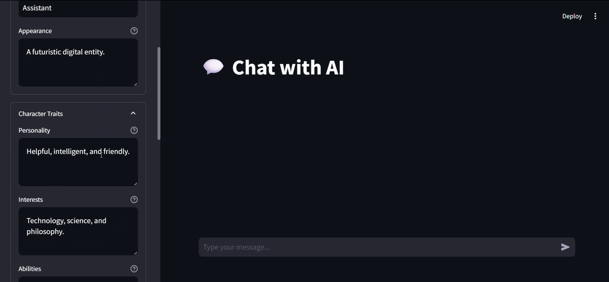

# RAG-Customizable-Chatbot

A **Retrieval-Augmented Generation (RAG) based customizable chatbot** built with Python and Streamlit. This project enables you to create, configure, and interact with AI chatbots using your own documents or web data—perfect for character-driven chatbots, document Q&A, or research assistants.

## 🎬 Watch the Demo

[](https://youtu.be/HbY8R6-jsx8)

> Click the thumbnail above to watch a quick demo of the project in action.


---

## Features

- **Flexible Document Import:**  
  Upload text, PDF, CSV, or source code files (`.txt`, `.pdf`, `.csv`, `.py`, etc.) to build a vectorstore for retrieval-augmented generation.

- **Web Content Integration:**  
  Securely fetch and process content from reputable web domains for chatbot context enrichment.

- **Character Customization:**  
  Configure personality, interests, abilities, and advanced traits for your chatbot via an interactive sidebar UI.

- **RAG Pipeline:**  
  Combines local document retrieval (FAISS + HuggingFace embeddings) with large language models (supports Groq LLMs) for context-aware, accurate responses.

- **Streamlit UI:**  
  User-friendly sidebar for:
    - Character settings
    - Content import (files or web)
    - Debug and reset options
    - Instructions and usage guidance

---

## Getting Started

### Prerequisites

- Python 3.8+
- [Streamlit](https://streamlit.io/)
- [langchain](https://python.langchain.com/)
- [faiss-cpu](https://github.com/facebookresearch/faiss)
- [HuggingFace Transformers](https://huggingface.co/docs/transformers/index)
- [pdfplumber](https://github.com/jsvine/pdfplumber)
- [dotenv](https://pypi.org/project/python-dotenv/)

### Installation

```bash
git clone https://github.com/ArhamMirza/RAG-Customizable-Chatbot.git
cd RAG-Customizable-Chatbot
pip install -r requirements.txt
```

Set your API keys in a `.env` file:

```
HF_TOKEN=your_huggingface_token
GROQ_API_KEY=your_groq_api_key
```

### Running the App

```bash
streamlit run app.py
```
*Or run your specific Streamlit entrypoint, e.g., `main.py`, depending on your setup.*

---

## Usage

1. **Character Settings:**  
   Adjust the chatbot's personality, interests, and abilities from the sidebar.

2. **Import Content:**  
   - Upload a file: TXT, PDF, CSV, or code.
   - Import from a web URL.

3. **Preview & Apply:**  
   Review extracted info and apply it to your bot's context.

4. **Chat:**  
   Ask questions! The bot retrieves relevant document chunks and generates informed answers.

5. **Debug/Reset:**  
   View chat history or reset the session from the sidebar.

## File Structure

```
chatbot/
  ├── manager.py       # Chatbot logic, config, vectorstore, QA chain
  └── processor.py     # File/web import, text extraction, security
ui/
  └── sidebar.py       # Streamlit sidebar: settings, import, debug
app.py / main.py       # Streamlit application entrypoint
```

---

## License

*No license specified yet.*

---

## Author

[ArhamMirza](https://github.com/ArhamMirza)

---
